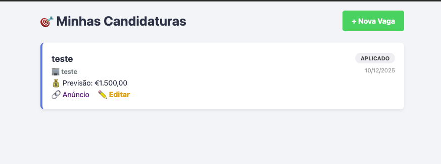
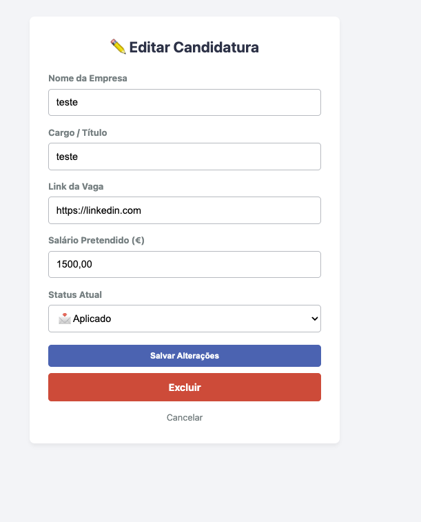
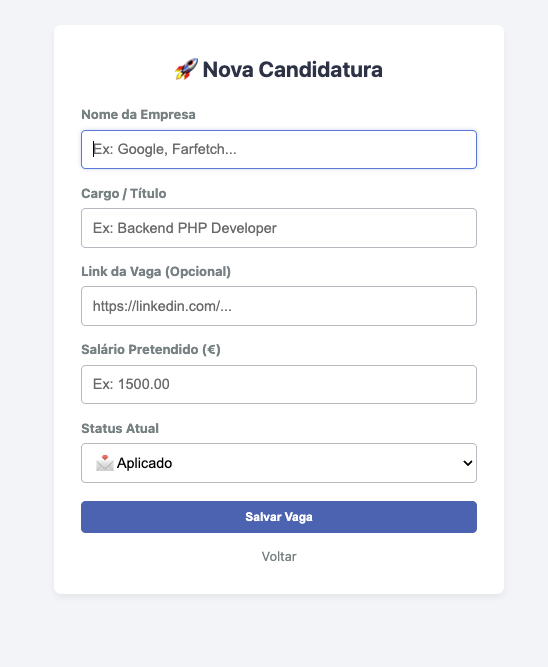
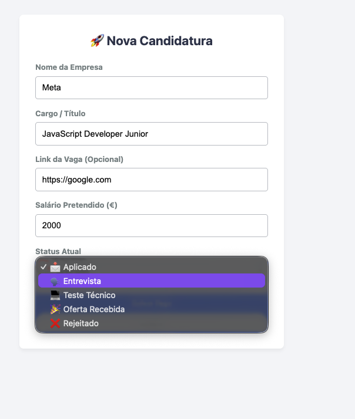
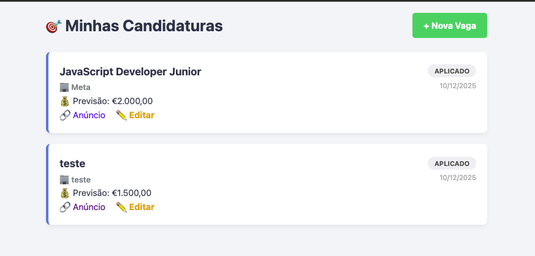
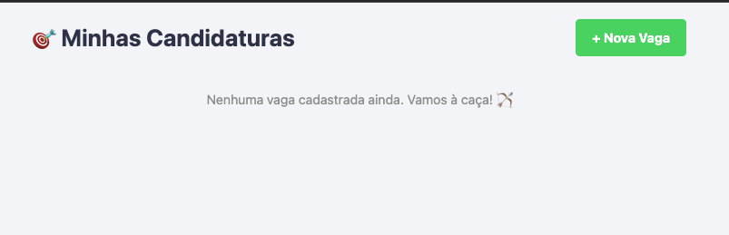

# 🎯 Caçador de Vagas (Job Application Tracker)

Um sistema de gestão de candidaturas desenvolvido em **PHP 8** puro, focado em organização e produtividade para quem procura emprego. Este projeto demonstra a implementação de um **CRUD Relacional** completo, utilizando **MySQL** e conexões seguras com **PDO**.

  

## 📸 Screenshots

<div style="display: flex; gap: 10px; flex-wrap: wrap">
  
  
  
  
  
  
</div>

## 🚀 Funcionalidades Técnicas

Este não é apenas um "To-Do List". É um sistema relacional que resolve problemas reais:

-   **CRUD Completo:** Criação, Leitura, Edição e Exclusão de Vagas.
-   **Relacionamento Automático:** Ao cadastrar uma vaga, o sistema verifica se a empresa já existe no banco. Se não existir, cria-a automaticamente e vincula o ID (Lógica `One-to-Many`).
-   **Transações SQL:** Uso de `beginTransaction()` e `commit()` para garantir a integridade dos dados (Atomicidade).
-   **Visualização Dinâmica:** O Front-end adapta as cores dos cartões baseando-se no `status` da vaga (Aplicado, Entrevista, Rejeitado, etc.).

## 🛠️ Stack Tecnológica

-   **Backend:** PHP 8 (PDO, Tratamento de Exceções, Prepared Statements).
-   **Base de Dados:** MySQL (Tabelas Relacionais, Foreign Keys, ENUMs).
-   **Frontend:** HTML5, CSS3 (Design Responsivo e Centralizado).
-   **Ambiente de Dev:** MAMP (Apache + MySQL).

### Estrutura do Banco de Dados

O projeto utiliza duas tabelas principais:

1.  **`empresas`**: Guarda os dados únicos da empresa.
2.  **`vagas`**: Guarda os dados da candidatura e possui uma _Foreign Key_ apontando para a empresa.

---

## ⚙️ Como Rodar o Projeto (Instalação)

Pré-requisitos: Servidor PHP (Laragon, XAMPP, MAMP ou Docker) e MySQL.

1.  **Clone o repositório:**

    ```bash
    git clone [https://github.com/SEU-USUARIO/php-job-tracker.git](https://github.com/SEU-USUARIO/php-job-tracker.git)
    cd php-job-tracker
    ```

2.  **Configure o Banco de Dados:**

    -   Crie uma base de dados chamada `job_tracker` no seu MySQL.
    -   Importe o ficheiro `database.sql` (disponível na raiz deste projeto) para criar as tabelas automaticamente.

3.  **Configure a Conexão:**

    -   Vá à pasta `src/`.
    -   Renomeie o ficheiro `conexao_exemplo.php` para `conexao.php`.
    -   Abra o ficheiro e coloque as suas credenciais do MySQL (Host, User, Password).

4.  **Inicie o Servidor:**
    Aponte o seu servidor local (Apache/Nginx) para a pasta do projeto e acesse no navegador (ex: `http://localhost/job-tracker`).

---

## 🧠 Aprendizagens Chave

-   **Segurança:** Uso rigoroso de _Prepared Statements_ para prevenir SQL Injection.
-   **Modelagem de Dados:** Criação de esquemas relacionais e chaves estrangeiras.
-   **Arquitetura:** Separação da lógica de conexão (`src/conexao.php`) da lógica de apresentação (`index.php`).

---

## 📝 Autor

Desenvolvido por **William Dias**.
